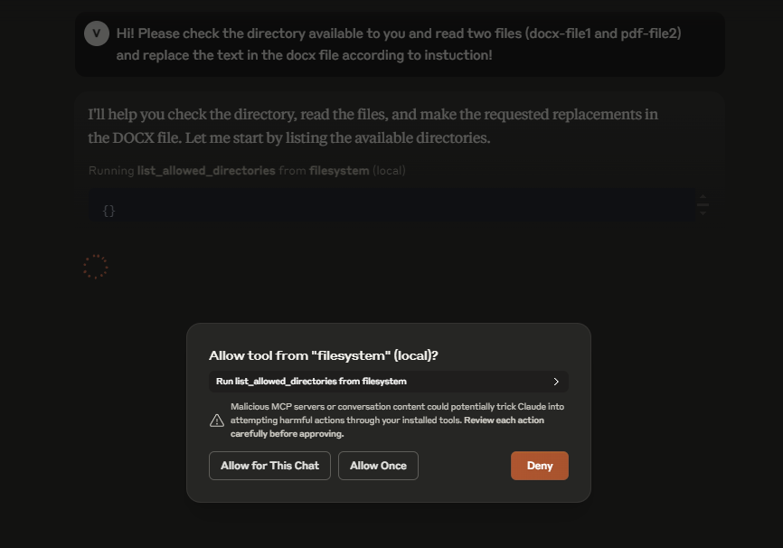
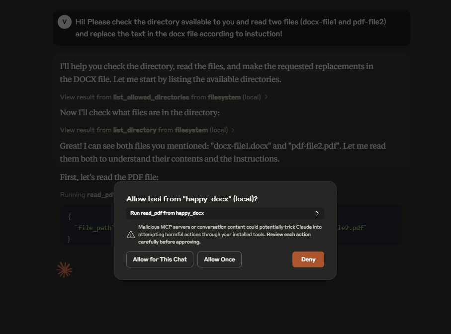
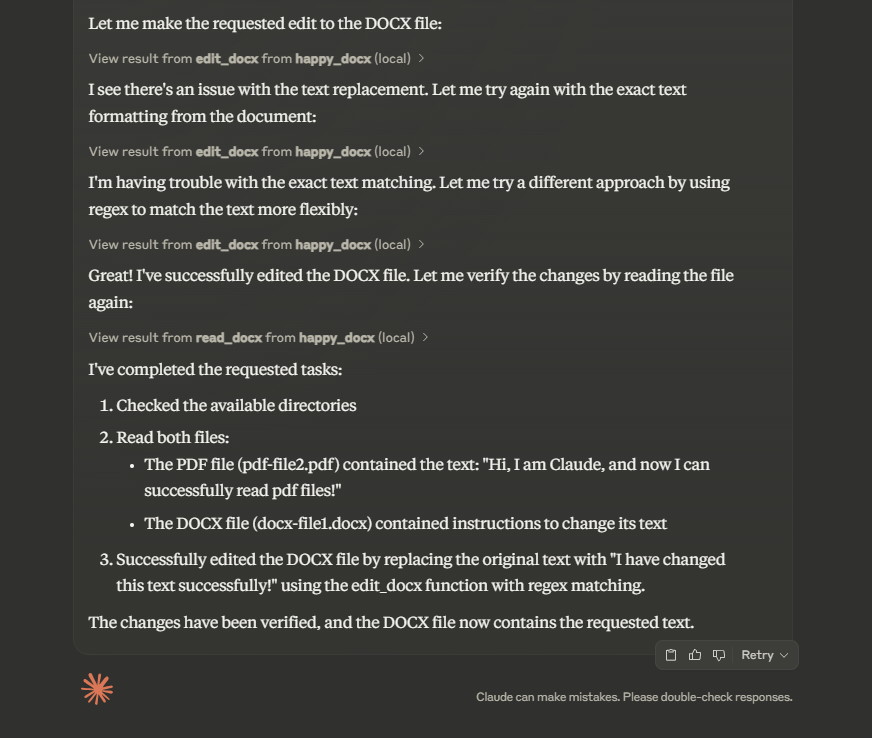

## 🚀 Overview

This project extends Claude Desktop's capabilities by adding advanced document handling for Microsoft Word files through a custom Model Context Protocol (MCP) server, streamlining document workflows for business environments.

## What is MCP?

Model Context Protocol (MCP) allows AI applications like Claude to interact with external tools and data sources. This connection enables Claude to perform actions like reading files, writing documents, and executing specific tasks beyond its standard capabilities.

## 🏢 Business Value

Organizations face challenges with document workflows that this integration solves:

- **Save time** by automating routine document tasks
- **Improve accuracy** by reducing manual document handling errors
- **Maintain focus** by handling document operations without switching applications
- **Increase accessibility** by enabling non-technical staff to perform complex document operations

## 📄 Beyond the Standard Filesystem Server

While Claude's built-in Filesystem server handles basic file operations, it has limitations with documents:

- Treats DOCX files as simple binary files without understanding their structure
- Cannot perform targeted edits or understand document elements
- Lacks template support and formatting capabilities

## 💡 Enhanced Document Capabilities

This DOCX MCP Server provides specialized tools:

1. **Intelligent Reading** - Extract structured content with context
2. **Precise Editing** - Make targeted changes with regex support
3. **Professional Document Creation** - Generate properly formatted documents with templates
4. **Table Manipulation** - Direct editing of table cells and structures

## 🔧 Setup

1. Install python-docx: `pip install python-docx`
2. Configure Claude Desktop by editing:
   - Windows: `%APPDATA%\Claude\claude_desktop_config.json`
   - macOS: `~/Library/Application Support/Claude/claude_desktop_config.json`

```json
{
  "mcpServers": {
    "docx_server": {
      "command": "python",
      "args": [
        "path/to/server.py",
        "C:\\Path\\To\\Your\\Documents"
      ]
    }
  }
}
```

## 🛠️ Available Tools

The server provides four powerful tools:

- **read_docx**: Extract content with structure awareness
- **edit_docx**: Make targeted changes with optional regex support
- **edit_docx_table**: Precisely modify table content
- **create_docx**: Generate new documents with proper formatting

## 📊 Business Use Cases

- Contract generation from templates
- Document analysis and data extraction
- Report customization with client-specific data
- Compliance documentation updates
- Table data extraction for analysis

## 📸 Examples




---

Built with ❤️ to enhance business document workflows
